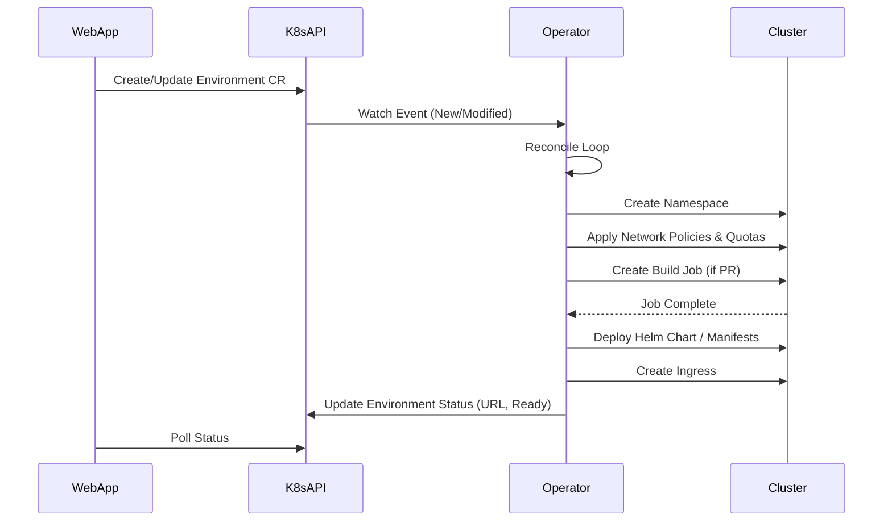

# kube-operator Specification

## Overview

`kube-operator` is a dedicated Kubernetes operator responsible for managing the lifecycle of Catalyst environments and deployments. It acts as the "backend" for Kubernetes operations, running in-cluster and reconciling Custom Resource Definitions (CRDs) to orchestrate infrastructure.

## Goals

1.  **Centralize Orchestration**: Move complex deployment logic (Helm, builds, namespaces) out of the web application and into a dedicated controller.
2.  **Declarative API**: Use Kubernetes CRDs (`Project`, `Environment`) as the interface between the web app and infrastructure.
3.  **Reliability**: Leverage Kubernetes controller patterns (reconciliation loops) to handle drift, failures, and retries robustly.
4.  **Security**: Run with elevated permissions in-cluster, allowing the web app to remain with minimal privileges.
5.  **Simplicity**: Greatly simplify the web application's logic by offloading imperative infrastructure management to the operator. The web app effectively becomes a CRUD interface for `Environment` CRs, while the operator handles the complexity of bringing those environments to the desired state.

## Architecture

The operator is built using the **Kubernetes Operator Pattern**.

### Components

1.  **Controller Manager**: The main process managing the controllers.
2.  **Project Controller**: Reconciles `Project` resources.
3.  **Environment Controller**: Reconciles `Environment` resources.
4.  **Build Controller**: Manages temporary build jobs for PRs.

### Interaction Flow



## Custom Resource Definitions (CRDs)

**API Group**: `catalyst.catalyst.dev/v1alpha1`

> Note: The API group is `catalyst.catalyst.dev` (group: `catalyst`, domain: `catalyst.dev` per kubebuilder convention).

### 1. Project (`projects.catalyst.catalyst.dev`)

Defines the configuration for a deployable application.

```yaml
apiVersion: catalyst.catalyst.dev/v1alpha1
kind: Project
metadata:
  name: my-project
  namespace: my-team # Lives in the Team Namespace
spec:
  source:
    repositoryUrl: "https://github.com/org/repo"
    branch: "main"
  deployment:
    type: "helm" # or "manifest", "kustomize"
    path: "./charts/app"
    values:
      image:
        repository: "registry.cluster.local/org/repo"
  resources:
    defaultQuota:
      cpu: "1"
      memory: "2Gi"
```

### 2. Environment (`environments.catalyst.catalyst.dev`)

Represents a specific instance of a project (e.g., a PR preview, staging, or production).

```yaml
apiVersion: catalyst.catalyst.dev/v1alpha1
kind: Environment
metadata:
  name: pr-123
  namespace: my-team-my-project # Lives in the Project Namespace
  labels:
    catalyst.dev/team: "my-team"
    catalyst.dev/project: "my-project"
    catalyst.dev/environment: "pr-123"
    catalyst.dev/branch: "feature/login"
spec:
  projectRef:
    name: my-project
  type: "development" # or "deployment" (prod/staging)
  source:
    commitSha: "a1b2c3d4..."
    branch: "feature/login"
    prNumber: 123
  config:
    envVars:
      - name: DEBUG
        value: "true"
status:
  phase: "Ready" # Pending, Building, Deploying, Failed, Ready
  url: "https://pr-123.preview.catalyst.dev"
  conditions:
    - type: "NamespaceReady"
      status: "True"
    - type: "BuildReady"
      status: "True"
    - type: "DeploymentReady"
      status: "True"
```

## Controllers & Logic

### Environment Controller

The core logic resides here. When an `Environment` CR is created or updated:

1.  **Namespace Management**:
    - Create target namespace following the hierarchy: `<team-name>-<project-name>-<environment-name>`.
    - **Validation**: Ensure the namespace name does not exceed 63 characters. If it does, apply the truncation and hashing procedure defined in the [Environments Specification](../specs/001-environments/spec.md#namespace-generation-procedure).
    - Apply standard labels to the namespace:
        - `catalyst.dev/team`: `<team-name>`
        - `catalyst.dev/project`: `<project-name>`
        - `catalyst.dev/environment`: `<environment-name>`
        - `catalyst.dev/branch`: `<branch-name>`
    - Apply `ResourceQuota` (CPU/Mem limits).
    - Apply `NetworkPolicy` (Isolation rules).

2.  **Build Orchestration (for PRs)**:
    - Check if image exists for `commitSha`.
    - If not, create a Kubernetes Job (Kaniko/Buildkit) to build and push to internal registry.
    - Watch Job status.

3.  **Deployment**:
    - Render Helm chart or manifests.
    - Inject specific values (image tag, ingress host, environment variables).
    - Apply resources to target namespace.

4.  **Ingress**:
    - Create Ingress resource pointing to the service.
    - Ensure TLS certificate issuance (via cert-manager integration).

5.  **Status Updates**:
    - Update CR status with current phase and public URL.
    - Report errors via status conditions.

### Cleanup

When an `Environment` CR is deleted:

1.  The controller's **Finalizer** triggers.
2.  Delete the target namespace (cascading delete of all resources).
3.  Remove the Finalizer to allow CR deletion.

## Technical Stack

- **Language**: Go (standard for K8s operators) or TypeScript (via Operator Framework/Kopf if preferred for team alignment, but Go is recommended for ecosystem maturity).
- **Framework**: Kubebuilder or Operator SDK.
- **Base Image**: Distroless or minimal Alpine.

## Migration from Web App

Currently, the web application (`web/src/lib/k8s-*.ts`) performs these tasks directly. The migration path:

1.  **Implement Operator**: Build the operator to handle `Environment` CRs.
2.  **Update Web App**:
    - Remove direct calls to `createNamespace`, `deployHelmChart`, etc.
    - Instead, have the web app create an `Environment` CR.
    - Web app polls `Environment` status to update UI/GitHub.
3.  **Cleanup**: Remove legacy orchestration code from `web/`.

## Security Considerations

- **RBAC**: The operator needs `ClusterRole` permissions to manage Namespaces, Deployments, Services, Ingresses, and NetworkPolicies.
- **Isolation**: The operator ensures that generated namespaces are locked down by default (NetworkPolicies).
- **Secrets**: The operator handles secret injection into environments without exposing them to the web app's read-only client.
